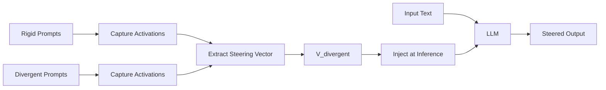

# LLSD

> **L**arge **L**anguage Models on L**S**D: Induce controlled divergent thinking in LLMs via activation steering

[](LICENSE)
[](https://www.python.org/downloads/)

LLSD enables dynamic control over the creativity and divergence of LLM outputs at inference time, without retraining or fine-tuning. By applying **activation steering** to the model's internal representations, you can shift thinking styles from literal/technical to metaphorical/associative.

## Key Features

- **Zero-Shot Creativity Control**: Adjust divergent thinking strength with a single parameter
- **No Model Retraining**: Works via inference-time intervention only
- **Minimal Overhead**: Efficient PyTorch hooks for real-time steering
- **Multiple Models**: Supports LLaMA-3, Mistral, and other transformer architectures
- **Research-Grade Tools**: Extract custom steering vectors from your own datasets

## Quick Start

### Installation

```bash
pip install llsd
```

For development:

```bash
git clone https://github.com/yourusername/llsd.git
cd llsd
pip install -e ".[dev]"
```

### Basic Usage

```python
from llsd import SteeringModel

# Load a steered model
model = SteeringModel.from_pretrained(
    "meta-llama/Meta-Llama-3-8B-Instruct",
    load_in_8bit=True  # For consumer GPUs
)

# Set divergence level: 0 = normal, 1-2 = creative, 3+ = surreal
model.set_divergence(alpha=1.5)

# Generate with divergent thinking enabled
prompt = "Explain quantum entanglement"
output = model.generate(prompt, max_new_tokens=200)
print(output)
```

### Example: Comparing Outputs at Different Alpha Values

```python
prompts = [
    "What is recursion?",
    "How does memory work in computers?",
]

for alpha in [0.0, 1.0, 2.0, 3.0]:
    print(f"\n{'='*60}")
    print(f"Alpha = {alpha}")
    print('='*60)
    
    model.set_divergence(alpha=alpha)
    for prompt in prompts:
        output = model.generate(prompt, max_new_tokens=100)
        print(f"\nPrompt: {prompt}")
        print(f"Output: {output}\n")
```

## How It Works

LLSD uses **contrastive activation steering** to identify and manipulate the "divergent thinking direction" in a model's activation space:



### The Process

1. **Contrastive Dataset**: Create paired prompts with identical intent but different styles
   - Rigid: "Explain recursion in precise technical terms"
   - Divergent: "Explain recursion as if mirrors were teaching themselves to dream"

2. **Activation Extraction**: Run both prompt types through the model and capture intermediate layer activations

3. **Direction Computation**: Calculate the steering vector:
   ```
   V_divergent = mean(divergent_activations) - mean(rigid_activations)
   ```

4. **Inference-Time Injection**: During generation, modify hidden states:
   ```
   h' = h + α * V_divergent
   ```
   where α controls steering strength

## Advanced Usage

### Extracting Custom Steering Vectors

```python
from llsd import ActivationCapture, extract_steering_vectors

# Create contrastive dataset
pairs = [
    {
        "rigid": "Explain sorting algorithms technically",
        "divergent": "Explain sorting as if items were finding their homes"
    },
    # ... more pairs
]

# Extract vectors from target layers
vectors = extract_steering_vectors(
    model_name="meta-llama/Meta-Llama-3-8B-Instruct",
    pairs=pairs,
    layers=[12, 16, 20, 24],
    method="mean_diff"  # or "pca"
)

# Save for later use
vectors.save("my_custom_vectors.pt")
```

### Multi-Vector Steering

Combine multiple steering dimensions:

```python
model.load_vectors({
    "divergent": "vectors/divergent.pt",
    "poetic": "vectors/poetic.pt",
    "technical": "vectors/technical.pt",
})

# Mix steering directions
model.set_multi_steering({
    "divergent": 1.5,
    "poetic": 0.8,
    "technical": -0.5  # Negative = steer away
})
```

## Project Structure

```
llsd/
├── src/llsd/
│   ├── __init__.py          # Main API exports
│   ├── model.py             # SteeringModel class
│   ├── hooks.py             # PyTorch activation capture/injection
│   ├── extraction.py        # Steering vector computation
│   ├── steering.py          # Inference-time steering logic
│   ├── dataset.py           # Contrastive dataset utilities
│   └── utils.py             # Helper functions
├── scripts/
│   ├── extract_vectors.py   # CLI for vector extraction
│   ├── demo.py              # Interactive demo
│   └── evaluate_basic.py    # Validation scripts
├── data/
│   └── contrastive_pairs.jsonl  # Example prompt pairs
├── vectors/                 # Pre-computed steering vectors
└── examples/                # Jupyter notebooks
```

## Research Applications

LLSD is designed for research into:

- **Creativity in AI**: Quantifying and controlling creative generation
- **Interpretability**: Understanding what "thinking styles" look like in activation space
- **Controllable Generation**: Fine-grained control over output characteristics
- **Cognitive Modeling**: Exploring parallels between human and machine creativity

## Performance Notes

- **VRAM**: ~8GB for LLaMA-3-8B with 8-bit quantization
- **Latency**: <5% overhead per token with steering enabled
- **Quality**: Best results typically at α ∈ [1.0, 2.5]

## Limitations

- Steering vectors are model-specific (not always transferable)
- High alpha values (>3.0) can degrade coherence
- Effect strength varies by layer and model architecture
- Extracted directions may capture style artifacts, not pure "creativity"

## Citation

If you use LLSD in your research, please cite:

```bibtex
@software{llsd2024,
  title = {LLSD: Controlled Divergent Thinking via Activation Steering},
  author = {Your Name},
  year = {2024},
  url = {https://github.com/yourusername/llsd}
}
```

## Contributing

We welcome contributions! See [CONTRIBUTING.md](CONTRIBUTING.md) for guidelines.

Key areas for contribution:
- New steering vector types (e.g., humor, formality, technicality)
- Support for additional model architectures
- Evaluation metrics for creativity/coherence trade-offs
- Triton kernels for optimized steering injection

## License

Apache 2.0 - See [LICENSE](LICENSE) for details.

## Acknowledgments

Inspired by:
- [Representation Engineering](https://arxiv.org/abs/2310.01405) (Zou et al., 2023)
- [Activation Addition](https://arxiv.org/abs/2308.10248) (Turner et al., 2023)
- Human cognitive neuroscience research on divergent thinking

## Related Projects

- [TransformerLens](https://github.com/neelnanda-io/TransformerLens) - Interpretability library
- [nnsight](https://github.com/JadenFiotto-Kaufman/nnsight) - Intervention framework
- [steering-vectors](https://github.com/steering-vectors/steering-vectors) - General steering library

---

**Status**: Early alpha - API subject to change. Contributions and feedback welcome!
